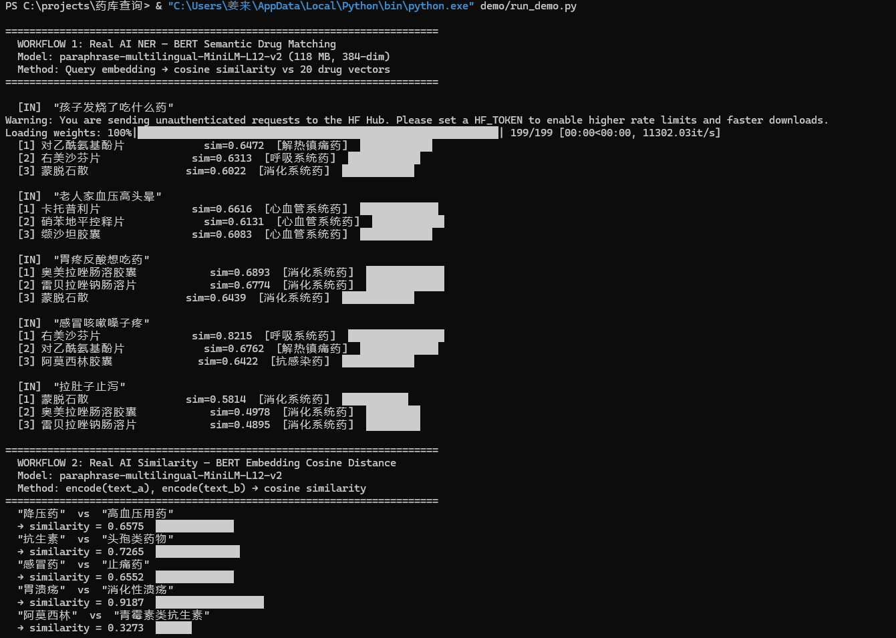
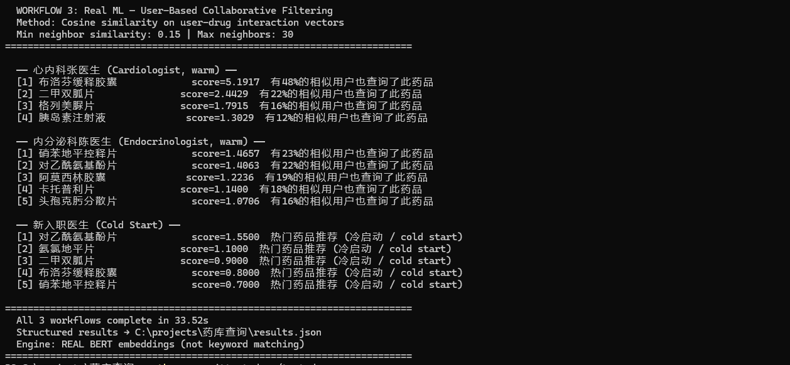
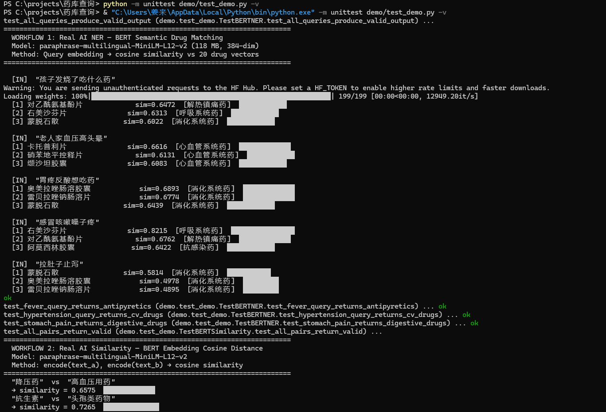
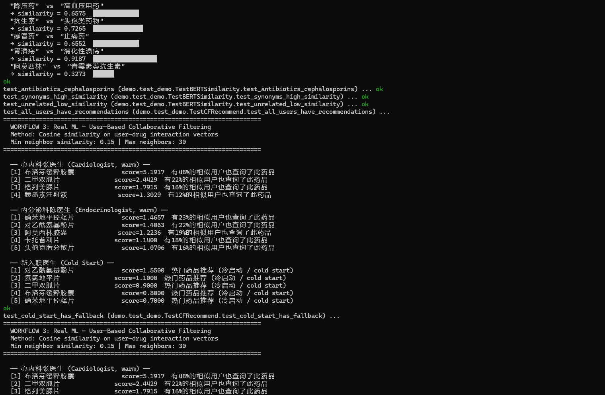
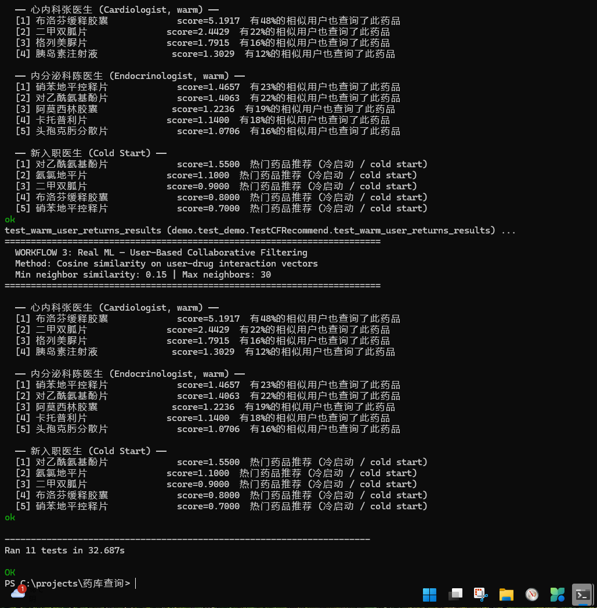

# PharmaQuery-AI-TestDemo

**10-minute verifiable AI pipeline for drug search — BERT embeddings + Collaborative Filtering.**

> No MySQL, no Java, no WeChat. Just Python + 3 commands.

## Quick Start

```bash
git clone https://github.com/JiangLai999/PharmaQuery-AI-TestDemo.git
cd PharmaQuery-AI-TestDemo
pip install -r requirements.txt
python run_demo.py
```

> First run downloads ~118 MB model. Subsequent runs are instant.

## What This Demo Proves

| Workflow | Engine | Real AI? |
|---|---|---|
| 1. Semantic Drug NER | BERT embeddings (384-dim) → cosine matching | ✅ |
| 2. Drug Similarity | BERT embedding cosine distance | ✅ |
| 3. Personalized Recommendation | User-Based Collaborative Filtering | ✅ |

### Key Result: "抗生素" vs "头孢类药物"

- Jaccard (character overlap): **0.00** — zero shared characters, keyword match fails
- BERT (semantic embedding): **0.73** — model learned cephalosporins are antibiotics from training data

## Screenshots / 运行截图

### Workflow 1: Real AI Semantic NER



### Workflow 2: Real AI Semantic Similarity



### Workflow 3: Collaborative Filtering Recommendation





### Test Results (11/11 Passing)



## Run Tests

```bash
python -m unittest test_demo.py -v
```

## Files

| File | Purpose |
|---|---|
| `ai_engine.py` | BERT model loader + inference |
| `run_demo.py` | 3 AI workflow demo |
| `test_demo.py` | 11 automated tests |
| `results.json` | Sample output |
| `DEBUG_LOG.md` | Real debugging log |
| `AI_COLLABORATION.md` | AI agent collaboration record |

## Model

`paraphrase-multilingual-MiniLM-L12-v2` — 118M parameters, 384-dim embeddings, 50+ languages including Chinese.
